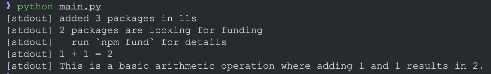
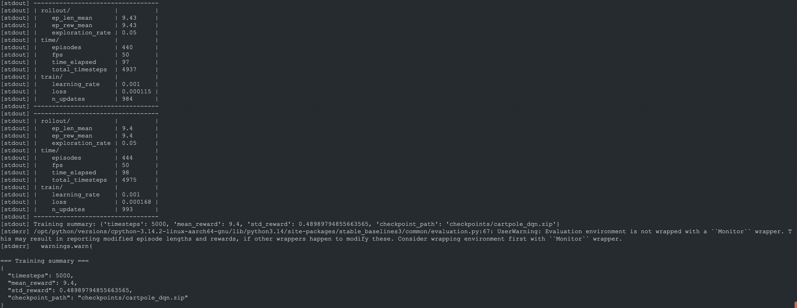
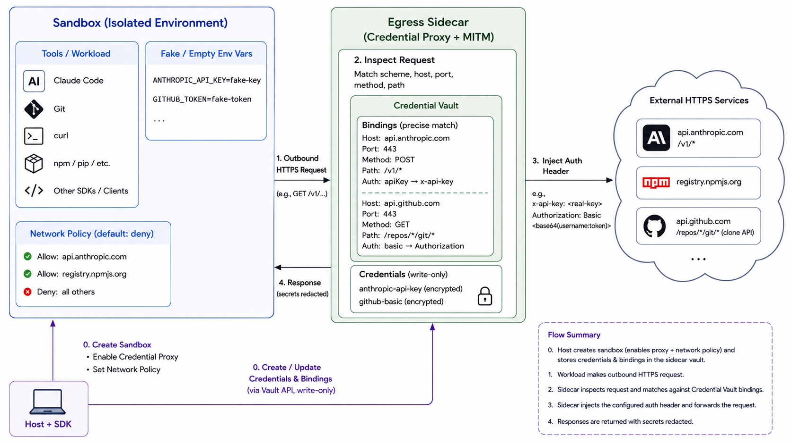
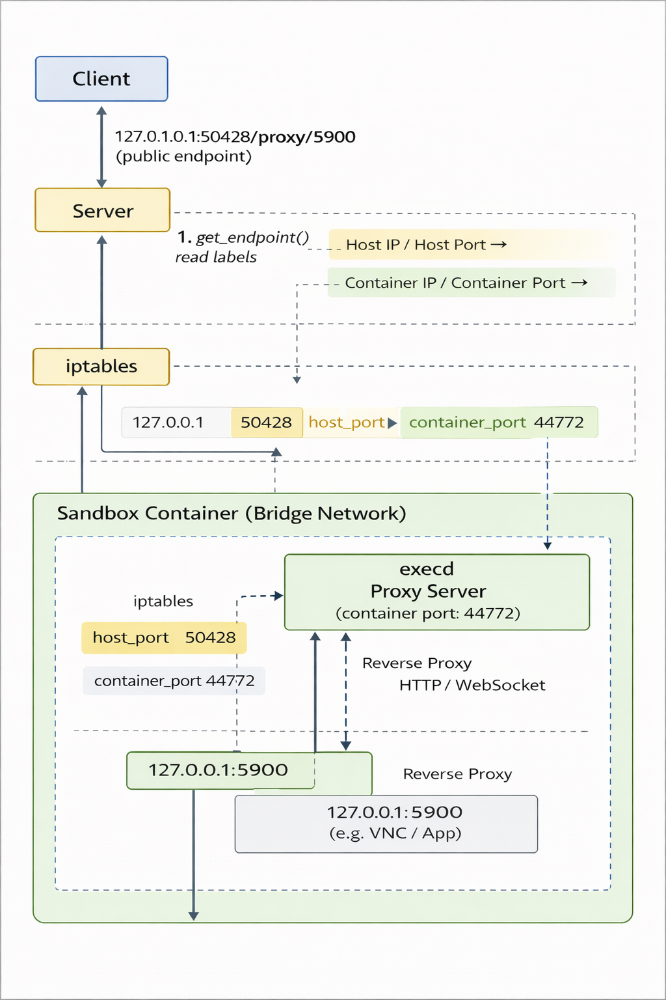
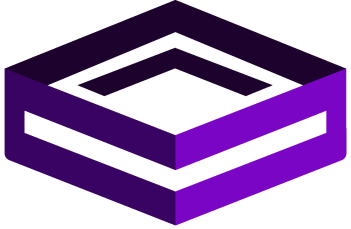

# Agenda

- Item 1
- Item 2
- Item 3

# Secure Container Runtimes {background-color="#f5f2ec"}

**Which isolation technology — and what does it cost you?**

Four backends, one cluster, identical workload. *Measured.*

::: {.notes}
Before we talk about the product, we need to answer the foundational question: how do
you actually run untrusted, AI-generated code without it escaping onto your infrastructure?
This section is the R&D — we evaluated four isolation runtimes head-to-head on the same
cluster, same image, same SDK call. Everything you'll see is measured on our production VKS
cluster, not vendor marketing numbers.
:::

## 1.1 · Containers are not a security boundary {background-color="#f5f2ec" .smaller}

- A plain container **shares the host kernel**. One kernel LPE = full host compromise.
- Untrusted / AI-generated code is **adversarial by assumption** — you can't trust it not to try.

The isolation spectrum:

```text
  Weaker isolation ───────────────────────────────► Stronger isolation
  Namespaces      gVisor (runsc)          microVM (Kata)
  (runc)          userspace syscall        real guest kernel
  shared kernel   interception             in a KVM VM
                  ~80% syscall ABI         hardware-virt boundary
```

::: {.notes}
The default Kubernetes runtime, runc, gives you namespaces and cgroups — process isolation,
not security isolation. The kernel is shared. For our own internal apps that's fine. For code
an LLM wrote and we're executing on demand, it isn't — we have to assume it's hostile. Two real
technologies close that gap: gVisor, which puts a userspace kernel between the workload and the
host and intercepts syscalls; and Kata Containers, which boots a genuine Linux kernel inside a
hardware-virtualized microVM. We evaluated three Kata VMMs plus gVisor.
:::

## 1.2 · The four contenders {background-color="#f5f2ec" .smaller .scrollable}

| Runtime | How it isolates | Boundary | Host requirement |
|---|---|---|---|
| **kata-fc** (Firecracker) | Real guest kernel in a minimal KVM microVM | Hardware virt | `/dev/kvm` + nested-virt + devmapper |
| **kata-clh** (Cloud Hypervisor) | Real guest kernel in KVM microVM (Rust VMM) | Hardware virt | `/dev/kvm` + nested-virt |
| **kata-qemu** | Real guest kernel in KVM microVM (full device model) | Hardware virt | `/dev/kvm` + nested-virt |
| **gVisor** (runsc) | Userspace kernel intercepts syscalls | Syscall ABI | none — any Linux node |

::: {.notes}
Firecracker is AWS's minimal VMM — it's what powers Lambda and Fargate. Cloud Hypervisor is the
Rust-based equivalent from Intel. QEMU is the full-fat, general-purpose emulator — most compatible,
most overhead. All three run under Kata, the CNCF project that makes a VM look like a container to
Kubernetes. gVisor is the odd one out: no VM at all, it's a Go process that emulates the Linux
kernel in userspace. The critical operational line is the last column — three of these need nested
virtualization and special hardware; gVisor runs on any commodity node. That single fact drives a
lot of the cost story later.
:::

## 1.3 · How we measured {background-color="#f5f2ec" .smaller}

- Same cluster (VKS `annd2-monitoring`), same pre-baked image, same Python SDK call site.
- Only **RuntimeClass + target node pool** changed between runs.
- All numbers **p50**, measured end-to-end through the real ingress + control plane.

Three lenses:

1. **Pool path** — claim a pre-warmed slot (the hot path)
2. **No-pool path** — fresh sandbox, image cached
3. **Raw pod cold-init** — `kubectl apply` → Ready, server/SDK stripped out

::: {.notes}
Credibility depends on method, so one slide on it. We held everything constant and flipped one knob
at a time. We measured three different things because they answer different questions: the pool path
is what a user actually feels in production; the no-pool path is the fallback when the pool is empty;
and raw pod-init strips away our own software so we can see the pure runtime cost. When I quote a
number, I'll tell you which lens it's from.
:::

## 1.4 · ★ Headline results {background-color="#f5f2ec" .smaller .scrollable}

| Metric | kata-fc | kata-clh | kata-qemu | gVisor | Winner |
|---|---|---|---|---|---|
| Pool create (hot path) | **226 ms** | 391 ms | 452 ms | 245 ms | fc (gVisor +8%) |
| Pool total (create+exec+kill) | **325 ms** | 489 ms | 558 ms | 356 ms | fc |
| No-pool create (image cached) | 2.90 s | 2.92 s | 3.91 s | **2.03 s** | gVisor |
| Pod-init floor p50 (idle node) | 2632 ms | 2666 ms | 3430 ms | **1855 ms** | gVisor |
| Scheduler overhead / pod | 250m/130Mi | 250m/130Mi | 250m/160Mi | **0 / 0** | gVisor |
| Nested-virt required | yes | yes | yes | **no** | gVisor |
| Isolation boundary | KVM microVM | KVM microVM | KVM microVM | syscall filter | — |

::: {.notes}
This is the whole section on one slide. Two clear winners depending on the path. On the pool path —
the hot path, where we've pre-warmed slots — Firecracker wins at 226 milliseconds; gVisor is within
8%, and CLH and QEMU trail badly at +73% and +100%. On the no-pool path — cold sandbox — gVisor wins
decisively at 2 seconds because there's no VM to boot; the Kata family pays roughly a full second for
guest-kernel boot. And gVisor has zero scheduler overhead and needs no special hardware. QEMU loses on
every single axis — it has no argument left on this cluster. The interesting story is fc-versus-gVisor,
and it's genuinely a workload question, not a 'which is better' question.
:::

## 1.5 · Where do the seconds go? {background-color="#f5f2ec" .smaller}

- Community claim: *"Firecracker boots in 200 ms."* True — but that's the **VMM process alone**.
- Our measured pod-ready for kata-fc: **~2.1 s**. Where's the gap?

| Phase (p50) | kata-fc | gVisor | What's happening |
|---|---|---|---|
| apply → Scheduled | 316 ms | 311 ms | k8s API + scheduler (runtime-independent) |
| Scheduled → Running | 1932 ms | 1452 ms | CNI + shim + microVM boot + rootfs + start |
| Running → Ready | ~0 | ~0 | readiness probe catches `execd` |

gVisor (no-microVM baseline) → microVM stack overhead:
**kata-clh +317 ms · kata-fc +480 ms · kata-qemu +1006 ms**

::: {.notes}
This slide preempts the smart question in the room. Everyone's heard Firecracker boots in 200
milliseconds, so why do we measure two seconds? Because 'Kubernetes pod ready' includes a whole stack
around the VMM: CNI networking, the containerd snapshotter, the kata shim, guest kernel boot, rootfs
setup, container start. Here's the elegant part — gVisor runs that same Kubernetes machinery with no
microVM, so the difference between gVisor and each Kata runtime is exactly the cost of the microVM
stack. Firecracker adds 480 milliseconds. The famous 200 ms is real — it's about 40% of that 480 — but
you can never reach it through Kubernetes. The other ~1.5 seconds is k8s plumbing that every runtime
pays equally, and no runtime choice fixes it.
:::

## 1.6 · Runtime performance under load {background-color="#f5f2ec" .smaller .scrollable}

Steady-state, reused sandbox (e2b-shim harness):

| Workload | gVisor | kata-clh | kata-fc |
|---|---|---|---|
| echo steady-state p50 | 59 ms | 39 ms | **18 ms** |
| `python -c pass` (cold interp) | 88 ms | 60 ms | **27 ms** |
| numpy 500×500 matmul | 381 ms | 251 ms | **156 ms** |
| `curl https://…` egress | 282 ms | 277 ms | **178 ms** |
| large file write (4 MiB) | **300 ms** | 639 ms | 471 ms |

::: {.notes}
Startup latency isn't the whole story — what about once the sandbox is running? Here Firecracker's
real kernel shows its value. Steady-state command latency, cold Python startup, CPU-bound numpy,
network egress — Firecracker is 2–3× faster than gVisor, because gVisor intercepts every single syscall
in userspace, and that tax compounds on syscall-heavy or compute-heavy work. The one place gVisor wins
is large file writes, because it writes straight to the host filesystem instead of through a virtio
layer. So for an interactive agent hammering tool calls in a loop, Firecracker's latency floor is the
thing users feel.
:::

## 1.7 · The ops reality {background-color="#f5f2ec" .smaller}

This is **not** plug-and-play:

- **kata-fc** needs the containerd **devmapper** snapshotter — VKS ships overlayfs only. We install a thin-pool via a DaemonSet.
- We took a node **NotReady** the first time (bad `/etc/containerd/config.toml` swap). Now every mutation is gated by `containerd config dump` dry-run before swap.
- All three Kata runtimes need **nested-virt** — a special, more expensive node pool (`/dev/kvm`).
- **gVisor:** installer DaemonSet, runs on commodity nodes, no kernel/containerd surgery.
- kata-fc devmapper has an **8 GiB per-image cap** — bites large rootfs workloads.

::: {.notes}
The benchmarks make Firecracker look great, but I want to be honest about what it costs to operate.
Firecracker on Kubernetes requires the devmapper snapshotter, which our managed Kubernetes doesn't
ship — we install it with a DaemonSet that patches containerd on each node. We learned the hard way:
our first attempt wrote a bad containerd config and took a node NotReady for an hour. The runbook now
dry-runs every config change before applying it. All three VM runtimes also need nested-virtualization
nodes, which are scarcer and pricier. gVisor, by contrast, is basically drop-in. This is the hidden tax
that doesn't show up in a latency chart but absolutely shows up in your on-call rotation.
:::

## 1.8 · Capacity & cost {background-color="#f5f2ec" .smaller}

- Kata reserves **130–160 MiB + 250m CPU per pod** for the VMM, on top of the workload's limits. gVisor reserves **nothing**.
- A `limits.memory=1Gi` pod actually reserves **1154 MiB** on a Kata node vs **1024 MiB** on gVisor.
- gVisor runs on commodity nodes (4 vCPU × 2); Kata needs nested-virt (8 vCPU).
- Net: gVisor **packs more sandboxes per dollar** — zero overhead + cheaper hardware.
- Our production pool (`realshell`, 15 kata-fc slots) is CPU-request bound on one nested-virt node (**86% of allocatable CPU**).

::: {.notes}
Capacity is where the runtime choice hits the budget. Every Kata pod carries a fixed 130-meg,
quarter-CPU reservation for the hypervisor before the workload gets anything — and it runs on the
expensive nested-virt hardware. gVisor has zero reservation and runs on commodity nodes. So for
high-density, cost-sensitive fleets, gVisor is fundamentally cheaper per sandbox. This matters directly
for unit economics when we productize — I'll come back to it in the cost section.
:::

## 1.9 · Verdict: a routing decision {background-color="#f5f2ec" .smaller .scrollable}

Not "X wins" — a validated routing table:

| If the workload is… | Use | Because |
|---|---|---|
| Interactive agent, rapid tool loops | **kata-fc** | Best dispatch + best steady-state latency, real kernel |
| Fresh sandbox per request (no pool) | **gVisor** | −30% cold latency, no nested-virt, zero overhead |
| High density / cost-sensitive fleet | **gVisor** | Zero scheduler overhead + commodity nodes |
| Needs ptrace / io_uring / mount / kernel modules | **kata-fc / clh** | gVisor's ~80% syscall coverage fails these |
| Highest-trust isolation | **kata-fc** | Hardware-virt boundary, minimal attack surface |
| Fallback / GPU / PCI passthrough | **kata-clh** | Working alternative if FC support drops |
| — anything — | kata-qemu | No axis where it wins; keep only for QEMU-specific device models |

**Production default:** kata-fc for the pool hot-path; gVisor for no-pool / density.

::: {.notes}
So the takeaway isn't 'X wins.' It's that we now have a validated, measured routing table. Firecracker
is our default for the hot interactive path because it's fastest where users feel it and gives the
strongest isolation. gVisor is the right backend for cold, per-request, or high-density workloads. QEMU
is off the table. And crucially — our platform can route per-workload: a multi-tenant deployment could
send shell and code sandboxes to gVisor and full-Linux workloads to Firecracker, from the same control
plane. That flexibility is a product feature, and it's the bridge into Section 2.
:::

# OpenSandbox {background-color="#f4f2fb"}

{height="150px" fig-align="center"}

Universal Sandbox Infrastructure for AI Applications

::: {.notes}
This section introduces OpenSandbox. Arrow **right** to move between the five movements
(Framing → Architecture → Core flows → Hands-on → Wrap), and **down** to go deeper within one.
:::

## What is OpenSandbox? {background-color="#f4f2fb" .smaller}

> Securely run commands, code interpreters, browsers, and developer tools in **isolated environments** with multi-language SDKs.

::: {.fragment}
A general-purpose **sandbox platform for AI applications**:
:::

::: {.incremental}
- Multi-language **SDKs** + a `osb` **CLI** + an **MCP server**
- A standardized **lifecycle & execution protocol** (OpenAPI)
- **Docker** and **Kubernetes** runtime backends
- In-sandbox execution: commands, files, code interpreters, browsers, desktops
:::

::: {.fragment}
Listed in the [CNCF Landscape](https://landscape.cncf.io/?item=orchestration-management--scheduling-orchestration--opensandbox).
:::

## Why does it exist? {background-color="#f4f2fb" .smaller}

AI applications increasingly need to run **untrusted, model-generated, or agentic code**.

::: {.incremental}
- 🤖 **Coding agents** execute shell commands and edit files
- 🧪 **Code interpreters** run model-generated code
- 🌐 **Browser automation** drives real Chrome / Playwright sessions
- 🎯 **RL & evaluation** launch thousands of throwaway environments
:::

::: {.fragment}
All of it needs **isolation**, **lifecycle management**, and a **uniform API** —
regardless of whether it runs on a laptop or a Kubernetes cluster.
:::

## Typical scenarios {background-color="#f4f2fb"}

:::: {.columns}
::: {.column width="50%"}
{width="92%" style="border-radius:8px;border:1px solid #ddd;"}
:::
::: {.column width="50%"}
{width="92%" style="border-radius:8px;border:1px solid #ddd;"}
:::
::::

:::: {.columns}
::: {.column width="50%"}
{width="92%" style="border-radius:8px;border:1px solid #ddd;"}
:::
::: {.column width="50%"}
{width="92%" style="border-radius:8px;border:1px solid #ddd;"}
:::
::::

::: {.notes}
Also: AI code execution (stream generated-code output) and enterprise isolation
(secure runtimes + egress + ingress). Every one of these is just a sandbox with
a different image and entrypoint.
:::

# Architecture {background-color="#eef3fb"}

Six practical surfaces

## Architecture at a glance {background-color="#ffffff"}

{.r-stretch fig-align="center"}

::: {.notes}
The official architecture diagram: clients at the top, public OpenAPI contracts,
the lifecycle control plane, Docker/Kubernetes runtime backends, the sandbox data
plane (user container + execd + sidecars), and the network & security plane.
Walk top-to-bottom, then we take each surface in turn.
:::

## The six surfaces {background-color="#eef3fb" .smaller}

::: {.incremental}
1. **Client** — SDKs · `osb` CLI · MCP
2. **Protocol** — OpenAPI contracts (`specs/`)
3. **Control plane** — FastAPI lifecycle server
4. **Runtime** — Docker & Kubernetes
5. **Data plane** — container + `execd` + sidecars
6. **Network & security** — ingress · egress · isolation
:::

::: {.fragment}
> Contracts for SDKs · orchestration in the server · platform specifics in runtimes · in-sandbox ops in `execd`/egress.
:::

## ① Client surface {background-color="#eef3fb" .smaller}

**SDKs** in 5 languages wrap both lifecycle **and** in-sandbox operations behind language-native APIs:

::: {.columns}
::: {.column width="42%"}
- Python
- JavaScript / TypeScript
- Java / Kotlin
- C# / .NET
- Go
:::
::: {.column width="58%"}
**Common capabilities**

- Create / list / inspect / pause / resume / renew / delete
- Resolve service **endpoints** for sandbox ports
- Execute commands with **streamed** output + background polling
- Manage files & directories, read `execd` **metrics**
- Inspect / patch runtime **egress policy**
:::
:::

::: {.fragment}
Generated OpenAPI clients + handwritten adapters (ergonomics, streaming, error mapping).
:::

## ① Client — CLI & MCP {background-color="#eef3fb" .smaller .scrollable}

:::: {.columns}
::: {.column width="55%"}
**`osb` CLI** — day-to-day operations

| Command | Does |
|---|---|
| `osb sandbox` | lifecycle & endpoints |
| `osb command` | run, background logs, shell |
| `osb file` | file & directory ops |
| `osb egress` | inspect / mutate egress policy |
| `osb devops` | low-level diagnostics |
| `osb skills` | install agent skills |
:::
::: {.column width="45%"}
**MCP server**

Exposes focused **sandbox / command / text-file** tools to MCP clients like **Claude Code** and **Cursor**.

**Code Interpreter SDKs**

Higher-level clients over `execd` code execution — manage contexts, run code per language.
:::
::::

## ② Protocol surface {background-color="#eef3fb" .smaller}

`specs/` is the public contract — **protocol first**.

| Spec | Purpose |
|------|---------|
| `sandbox-lifecycle.yml` | Create / list / pause / resume / renew / snapshot |
| `diagnostic-api.yml` | Logs & events descriptors |
| `execd-api.yaml` | In-sandbox execution (commands, files, code) |
| `egress-api.yaml` | Runtime egress policy |

::: {.fragment}
SDKs and generated clients **align to the specs** rather than drifting from them.
:::

## ② Lifecycle request — key fields {background-color="#eef3fb" .smaller}

`POST /v1/sandboxes` speaks one runtime-neutral shape:

::: {.columns}
::: {.column width="50%"}
- `image` **or** `snapshotId` — startup source
- `entrypoint`, `env`, `metadata`, opaque `extensions`
- `resourceLimits` — CPU / memory / GPU
- `platform` constraints
:::
::: {.column width="50%"}
- `volumes` — `host` / `pvc` / `ossfs`
- `networkPolicy` — egress sidecar config
- `secureAccess` — endpoint credentials (K8s ingress)
:::
::::

::: {.fragment}
Plus **Snapshots**: create a persistent snapshot from a sandbox, then start new sandboxes from it.
:::

## ③ Lifecycle control plane {background-color="#eef3fb" .smaller}

A **FastAPI** server (`server/`) that owns orchestration:

::: {.incremental}
- **Authenticates** requests (API key) & validates config
- Selects **exactly one** runtime: `docker` **or** `kubernetes`
- **Persists** server-managed records (SQLite by default)
- **Resolves endpoints** — Docker-mapped, ingress gateway, or server proxy
- Optional **auto-renew on access**
:::

::: {.fragment}
API routes stay **thin** — behavior lives behind the `SandboxService` interface.
:::

## ③ Control plane — specifics {background-color="#eef3fb" .smaller .scrollable}

:::: {.columns}
::: {.column width="50%"}
**Config** — a TOML file (`~/.sandbox.toml`)

- `[runtime].type` → `docker` | `kubernetes`
- `[store]` → SQLite by default
- `[egress]`, `[ingress]`, `[secure_runtime]`
- TTL caps, `[renew_intent]`
:::
::: {.column width="50%"}
**Runtime features**

- Auth via `OPEN-SANDBOX-API-KEY` (disable-able for dev)
- Networking: **host** or **bridge** modes
- Resource quotas (K8s-style CPU/mem)
- **Async** provisioning; timers restored on restart
- Public **&** private image registries
:::
::::

::: {.fragment}
Endpoints resolve to a Docker-mapped host port, a K8s ingress gateway, or a **server proxy** (`/sandboxes/{id}/proxy/{port}`, HTTP + WebSocket).
:::

## ④ Runtime backends {background-color="#eef3fb" .smaller}

:::: {.columns}
::: {.column width="50%"}
**Docker** — local / single-host

- Talks directly to the Docker daemon
- Manages containers, ports, volumes, sidecars
- Stages `execd` + bootstrap into the container
- `pause`/`resume` at container level
:::
::: {.column width="50%"}
**Kubernetes** — via workload providers

- `batchsandbox` (default) — `BatchSandbox` CRD + `Pool`
- `agent-sandbox` — `kubernetes-sigs/agent-sandbox`
- Pooling & pre-warming for fast allocation
- `pause`/`resume` via rootfs snapshots
:::
::::

::: {.fragment}
**Runtime-neutral API, runtime-specific execution** — same contract, different materialization.
:::

## ④ Kubernetes — BatchSandbox {background-color="#eef3fb" .smaller}

:::: {.columns}
::: {.column width="52%"}
The K8s controller adds CRDs for high-throughput & pooled delivery:

- **`BatchSandbox`** — one *or many* replicas from a pod template
- **`Pool`** — pre-warmed resources for fast allocation
- **`SandboxSnapshot`** — rootfs snapshots for pause/resume

::: {.fragment}
Pause commits the rootfs to an OCI image and frees resources; resume recreates the workload from that image — **preserving the sandbox ID**.
:::
:::
::: {.column width="48%"}
{width="100%" style="border-radius:8px;border:1px solid #ddd;"}
:::
::::

## ⑤ Sandbox data plane {background-color="#eef3fb" .smaller}

Each sandbox = the **user's image + entrypoint**, with OpenSandbox processes injected around it:

::: {.incremental}
- **`execd`** — a Go daemon exposing the execution API (commands, files, PTY, code, metrics)
- **Code Interpreter runtime** — Jupyter kernels; `execd` streams kernel messages as SSE
- **Volumes** — `host` binds, `pvc` named storage, `ossfs` mounts
- **Egress sidecar** — enforces outbound network policy
:::

## ⑤ execd — the in-sandbox daemon {background-color="#eef3fb" .smaller .scrollable}

A **Go / Gin** daemon injected into every sandbox (default port `44772`).

:::: {.columns}
::: {.column width="55%"}
**API surface**

- `/code` — Jupyter code execution *(SSE)*
- `/command` + `/session` — commands & shells
- `/pty` — interactive PTY *(WebSocket)*
- `/files`, `/directories` — filesystem ops
- `/metrics`, `/metrics/watch` — CPU / mem
- `/ping` — health
:::
::: {.column width="45%"}
**Injection**

- **Docker:** server stages the `execd` binary + bootstrap into the container
- **K8s:** an init container copies `execd` + `bootstrap.sh` from `execd_image` into a shared `emptyDir`

Optional `X-EXECD-ACCESS-TOKEN` auth.
:::
::::

## ⑤ Code Interpreter runtime {background-color="#eef3fb" .smaller}

The official `code-interpreter` image runs **Jupyter** inside the sandbox; `execd` translates kernel messages into OpenSandbox streaming events.

::: {.incremental}
- Runtimes: **Python, Java, Node.js, Go**
- Jupyter kernels: **Python, Java, TypeScript/JS, Go, Bash**
- Versions pinned via `PYTHON_VERSION`, `JAVA_VERSION`, `NODE_VERSION`, `GO_VERSION`
:::

::: {.fragment}
Lower-level command / file / code APIs stay available through the sandbox SDKs directly.
:::

## ⑥ Networking & security {background-color="#eef3fb" .smaller}

::: {.incremental}
- **Ingress** — K8s HTTP/WS reverse proxy (header / URI / wildcard-host routing)
- **Secure access** — endpoint credentials & signed route tokens (K8s ingress mode)
- **Egress** — FQDN/wildcard allow-deny, DNS & `dns+nft` enforcement, runtime `PATCH /policy`
- **Secure defaults** — API-key auth, resource limits, capability drops, optional secure runtimes
:::

## ⑥ Ingress routing modes {background-color="#eef3fb" .smaller}

A K8s HTTP/WebSocket reverse proxy that watches sandbox CRs and routes to sandbox ports:

:::: {.columns}
::: {.column width="50%"}
**Header mode** (default)

```text
OpenSandbox-Ingress-To: <id>-<port>
# or Host: <id>-<port>.<domain>
```
:::
::: {.column width="50%"}
**URI mode**

```text
/<sandbox-id>/<port>/<path>
```
:::
::::

::: {.fragment}
Endpoints come from the `sandbox.opensandbox.io/endpoints` annotation (BatchSandbox) or `status.serviceFQDN` (agent-sandbox).
:::

## ⑥ Egress sidecar {background-color="#eef3fb" .smaller .scrollable}

Shares the sandbox **network namespace**; only the sidecar holds `CAP_NET_ADMIN`.

:::: {.columns}
::: {.column width="55%"}
- **L1 — DNS proxy** on `127.0.0.1:15353`; port-53 traffic redirected here, `NXDOMAIN` for denied domains
- **L2 — nftables** (`dns+nft`): resolved IPs added to allow-sets with TTL → true default-deny
- Rules: **FQDN**, `*.wildcard`, **IP / CIDR**
- **Fail-closed**: exits if it can't install the redirect
- Runtime `GET` / `PATCH /policy`
:::
::: {.column width="45%"}
{width="100%" style="border-radius:8px;border:1px solid #ddd;"}
:::
::::

## ⑥ Network isolation {background-color="#ffffff"}

{.r-stretch fig-align="center"}

::: {.notes}
Single-host network model: the egress sidecar sits in the sandbox network namespace,
the main container runs unprivileged, and outbound traffic is filtered before it leaves.
:::

# Core flows {background-color="#eef6f2"}

How the pieces work together

## Flow: creating a sandbox {background-color="#eef6f2"}

```{mermaid}
flowchart LR
  A[Client / SDK / CLI / MCP] --> B[POST /v1/sandboxes]
  B --> C[FastAPI server<br/>validate request + config]
  C --> D[Runtime service<br/>Docker or Kubernetes]
  D --> E[Stage execd +<br/>egress / volume / network]
  E --> F{Running<br/>or Failed}
```

::: {.fragment}
Creation is **asynchronous** — poll `GET /v1/sandboxes/{id}` or use SDK readiness helpers.
:::

## Flow: command / file / code execution {background-color="#eef6f2"}

```text
Client
  → resolve execd endpoint (sandbox metadata or server proxy)
  → call execd API with X-EXECD-ACCESS-TOKEN when required
  → execd runs command / file op / session / PTY / Jupyter code
  → streams SSE / WebSocket output or returns structured response
```

::: {.fragment}
Command and code execution stream output over **Server-Sent Events**; long-lived shells use **PTY over WebSocket**.
:::

## Flow: egress, pause & snapshots {background-color="#eef6f2" .smaller}

:::: {.columns}
::: {.column width="50%"}
**Egress policy**

- Create with `networkPolicy`
- Runtime attaches egress **sidecar**
- Outbound DNS/traffic filtered
- `PATCH /policy` at runtime
:::
::: {.column width="50%"}
**Pause / resume / snapshot**

- Docker: container pause/resume
- BatchSandbox: **rootfs snapshot** commit + recreate (preserves sandbox ID)
- Public snapshot API → restorable image
:::
::::

# Hands-on {background-color="#fbf1f6"}

Run it yourself

## 1 · Start the server {background-color="#fbf1f6"}

**Prerequisites:** Docker 20.10+, Python 3.10+, `uv` (or pip)

```bash
# Generate a starter config
uvx opensandbox-server init-config ~/.sandbox.toml --example docker

# Start the server
uvx opensandbox-server
```

```bash
# Verify it's running
curl http://127.0.0.1:8080/health
# → {"status": "healthy"}
```

## 2 · Create & use a sandbox {background-color="#fbf1f6" .smaller .scrollable}

```python
from opensandbox import Sandbox
from opensandbox.models import WriteEntry
from code_interpreter import CodeInterpreter, SupportedLanguage

sandbox = await Sandbox.create(
    "opensandbox/code-interpreter:v1.1.0",
    entrypoint=["/opt/code-interpreter/code-interpreter.sh"],
    env={"PYTHON_VERSION": "3.11"},
)
async with sandbox:
    # Shell command
    r = await sandbox.commands.run("echo 'Hello OpenSandbox!'")

    # Files
    await sandbox.files.write_files([WriteEntry(path="/tmp/hi.txt", data="Hi")])

    # Code interpreter
    ci = await CodeInterpreter.create(sandbox)
    out = await ci.codes.run("2 + 2", language=SupportedLanguage.PYTHON)
    print(out.result[0].text)  # 4
```

## 3 · The `osb` CLI {background-color="#fbf1f6" .smaller}

```bash
pip install opensandbox-cli

osb config init
osb config set connection.domain localhost:8080
osb config set connection.protocol http

osb sandbox create --image python:3.12 --timeout 30m -o json
osb command run <sandbox-id> -o raw -- python -c "print(1 + 1)"
```

{width="70%" fig-align="center" style="border-radius:8px;border:1px solid #ddd;"}

::: {.notes}
Same lifecycle, three faces: SDK, CLI, and MCP — pick what fits your workflow.
:::

# Wrap-up {background-color="#f4f2fb"}

## Design principles {background-color="#f4f2fb" .smaller}

::: {.incremental}
- **Protocol first** — behavior starts from OpenAPI contracts
- **Control plane vs data plane** — server orchestrates, `execd`/egress operate in-sandbox
- **Runtime-neutral API, runtime-specific execution** — Docker & K8s, one contract
- **Secure defaults with explicit escape hatches**
- **Observable failures** — `state` / `reason` / `message`, metrics, request IDs
:::

## OpenSandbox — recap {background-color="#f4f2fb"}

One platform to **provision, execute in, and tear down** isolated environments for AI workloads.

**Learn more:**

- Getting Started · Architecture · Examples — [the OpenSandbox docs](https://github.com/opensandbox-group/OpenSandbox/tree/main/docs)
- [GitHub: opensandbox-group/OpenSandbox](https://github.com/opensandbox-group/OpenSandbox)
- [CNCF Landscape entry](https://landscape.cncf.io/?item=orchestration-management--scheduling-orchestration--opensandbox)

# Agent Sandbox {background-color="#e6f2f0"}

{height="130px" fig-align="center"}

A Kubernetes-native **`Sandbox`** CRD & controller · `kubernetes-sigs/agent-sandbox`

::: {.notes}
Where OpenSandbox is a full platform, Agent Sandbox is the upstream Kubernetes-native
primitive: a Sandbox CRD under SIG Apps. It's also one of the workload providers
OpenSandbox can target — so this is the standards layer beneath what we just saw.
:::

## What is Agent Sandbox? {background-color="#e6f2f0" .smaller}

> Easy management of **isolated, stateful, singleton workloads** — ideal for AI agent runtimes.

::: {.incremental}
- A **`Sandbox` CRD + controller** for Kubernetes (under **SIG Apps**)
- A declarative API for a **single stateful pod** with stable identity + persistent storage
- The feel of a **lightweight single-container VM**, built on native k8s primitives
- Fills the gap between **Deployments** (stateless/replicated) and **StatefulSets** (numbered)
:::

::: {.fragment}
API group: `agents.x-k8s.io` (`v1alpha1` → `v1beta1`).
:::

## The Sandbox CRD {background-color="#e6f2f0" .smaller .scrollable}

:::: {.columns}
::: {.column width="46%"}
**Key features**

- **Stable identity** — stable hostname & network identity
- **Persistent storage** — survives restarts (PVC templates)
- **Lifecycle** — create · scheduled delete · **pause / resume**
:::
::: {.column width="54%"}
```yaml
apiVersion: agents.x-k8s.io/v1beta1
kind: Sandbox
metadata:
  name: hello-world
spec:
  podTemplate:
    spec:
      containers:
      - name: my-container
        image: my-registry/hello-world:latest
      restartPolicy: Never
```
:::
::::

::: {.fragment}
`lifecycle.shutdownTime` + `shutdownPolicy` (`Retain` | `Delete`) handle expiry.
:::

## Extensions: pools & templates {background-color="#e6f2f0" .smaller}

Built on top of the core `Sandbox` API:

::: {.incremental}
- **`SandboxTemplate`** — reusable definitions for creating many similar Sandboxes
- **`SandboxWarmPool`** — a pool of **pre-warmed** Sandboxes for fast allocation
- **`SandboxClaim`** — grab a ready Sandbox from a warm pool, hiding the config details
:::

::: {.fragment}
The warm-pool + claim pattern is what drives **sub-second** sandbox assignment.
:::

## Architecture {background-color="#e6f2f0" .smaller}

```{mermaid}
flowchart LR
  User[User]
  User -->|creates| Sandbox
  User -->|creates| Claim[SandboxClaim]
  Template[SandboxTemplate]
  WarmPool[SandboxWarmPool] -->|references| Template
  WarmPool -->|pre-warms| Sandbox
  Claim -->|adopts from| WarmPool
  Sandbox -->|creates| Pod
  Pod --> Runtime[Sandbox Runtime]
```

::: {.notes}
Standard Kubernetes controller pattern: you declare a Sandbox (or a Claim), and the
controller reconciles the backing Pod and runtime. The WarmPool pre-creates Sandboxes
from a Template so a Claim can adopt one instantly instead of waiting for cold creation.
:::

## API & SDKs {background-color="#e6f2f0" .smaller}

:::: {.columns}
::: {.column width="50%"}
**API groups**

- `agents.x-k8s.io` — core `Sandbox`
- `extensions.agents.x-k8s.io` — Template / Claim / WarmPool
- Evolving **alpha → beta**
:::
::: {.column width="50%"}
**Clients**

- **Go SDK** — `sigs.k8s.io/agent-sandbox/clients/go/sandbox`
- **Python SDK** — high-level create/manage
- **TypeScript SDK** — *in progress*
- **MCP server** — *planned*
:::
::::

## Install & run {background-color="#e6f2f0" .smaller .scrollable}

```bash
export VERSION="v0.1.0"   # a release tag

# Core controller + CRDs
kubectl apply -f https://github.com/kubernetes-sigs/agent-sandbox/releases/download/${VERSION}/manifest.yaml

# Extensions (SandboxTemplate / SandboxClaim / SandboxWarmPool)
kubectl apply -f https://github.com/kubernetes-sigs/agent-sandbox/releases/download/${VERSION}/extensions.yaml
```

```bash
kubectl apply -f hello-world.yaml
kubectl get sandbox hello-world     # controller provisions the Pod
```

## Scale & performance {background-color="#e6f2f0" .smaller}

::: {.incremental}
- Tunable controller concurrency — `--sandbox-claim-concurrent-workers` (def. 50), warm-pool batch size (def. 300)
- Target: **1000+ claims/sec**; claim latency **200 ms → 100 ms → 50 ms**
- **Scale-to-zero** — suspend inactive sandboxes, keep a fast resume path
- **TFFI** (Time-To-First-Instruction) as a first-class benchmark
:::

::: {.fragment}
Warm pools + suspend/resume are the levers for price-performance at fleet scale.
:::

## Roadmap highlights {background-color="#e6f2f0" .smaller .scrollable}

| Theme | Notable items |
|---|---|
| Core | Portable backend (decouple API from runtime), Template/WarmPool rolling updates, 1st-class router, auto suspend/resume |
| SDKs | Expand Python, TypeScript SDK, **MCP server** |
| Price-perf | Scale-to-zero, TFFI benchmarks, 1000+ claims/sec |
| Networking | NetworkPolicy attach at claim time, per-claim identity & storage |
| Ecosystem | Ray (RLlib), LangChain / CrewAI / kAgent, curated browser & shell images |

## Where it fits {background-color="#e6f2f0" .smaller}

::: {.incremental}
- **Upstream, vendor-neutral** Kubernetes primitive for agent workloads (SIG Apps)
- OpenSandbox can target it as its **`agent-sandbox` workload provider** — reading `status.serviceFQDN` for routing
- Think: **the CRD standard** underneath higher-level platforms like OpenSandbox
:::

::: {.fragment}
Same goal as this whole talk — **run untrusted agent code safely** — expressed as a native k8s API.
:::

## Agent Sandbox — links {background-color="#e6f2f0" .smaller}

- [agent-sandbox.sigs.k8s.io](https://agent-sandbox.sigs.k8s.io) · [Docs](https://agent-sandbox.sigs.k8s.io/docs/) · [Getting Started](https://agent-sandbox.sigs.k8s.io/docs/getting_started/)
- [GitHub: kubernetes-sigs/agent-sandbox](https://github.com/kubernetes-sigs/agent-sandbox) · [Roadmap](https://github.com/kubernetes-sigs/agent-sandbox/blob/main/roadmap.md)

# Documentation

See the [Quarto documentation](https://quarto.org/docs/presentations/revealjs/).

# PDF

Want to grab a PDF version?

Try the [PDF Export mode](https://quarto.org/docs/presentations/revealjs/presenting.html#print-to-pdf) from Chrome/Chromium.

Alternatively (and sometimes for better result), use [decktape](https://github.com/astefanutti/decktape):

```shell
decktape --size='2048x1536' 'http://localhost:7996' slides.pdf
```

# The End
